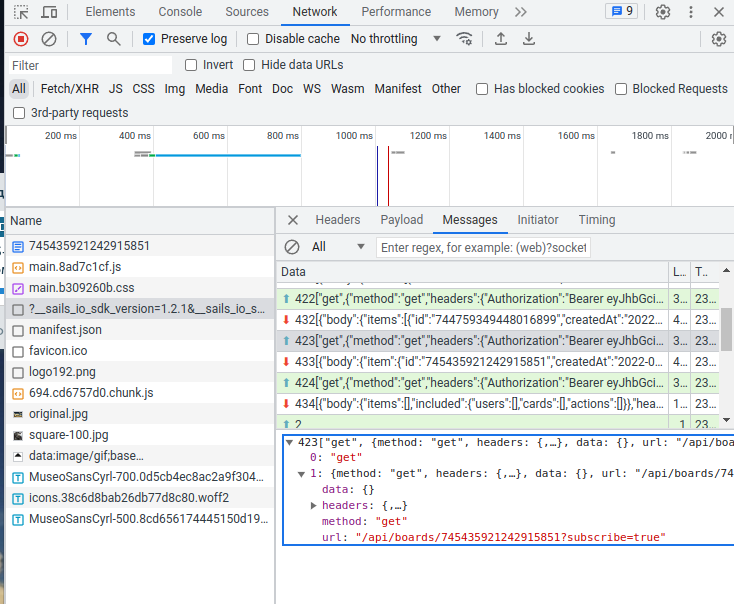
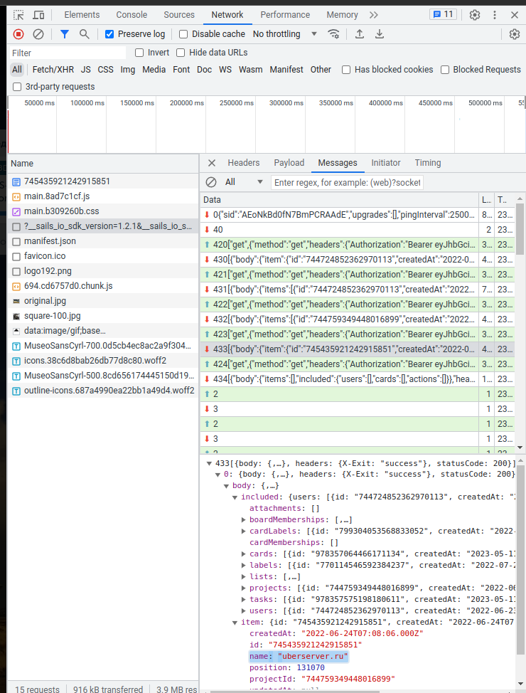
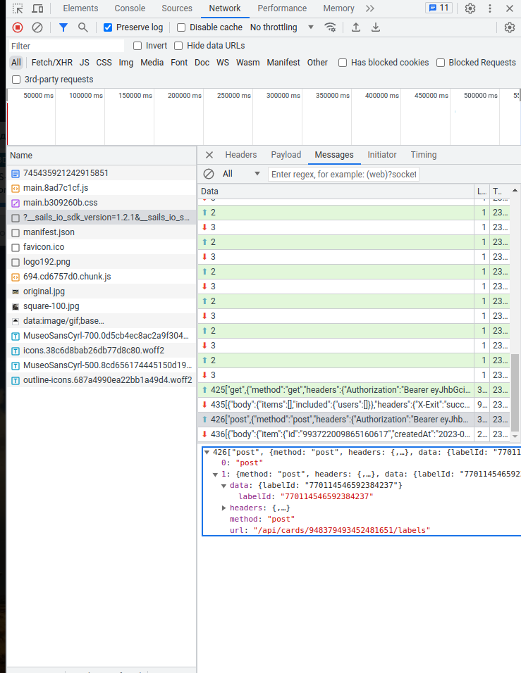

# Planka automation 


### MVP (minimal version product)


## Features:

- Automatically number with a prefix prefix `[<prefix>-<number>]` cards by specific label
- Transferring cards from column Archive to another board with the Archive/Trash column
- WebHook for Sentry, create a card in the project with the label "Bugfix"
- Notify in telegram about a suitable deadline by card.


### What to do first:

Copy .env in .env.local

To activate the feature, you need to set the feature to true in .env.local

Example:

```
IS_ENABLE_FEATURE_AUTO_NUMERATOR=true
IS_ENABLE_FEATURE_DRAG_FINISH_CARD_TO_ARCHIVE_BOARD=true
IS_ENABLE_FEATURE_SENTRY_ISSUE_CARD=true
IS_ENABLE_FEATURE_NOTIFY_DEADLINE_CARD_CARD=true
```


### You should also configure the remaining parameters.

What do the parameters mean in .env:

- `SENTRY_DSN` - Sentry URL, for debug and error tracking


- `TELEGRAM_BOT_TOKEN` - telegram token bot, example: `5123123123:AAAAAAAAAAAAAAAAAAA`
- `TELEGRAM_BOT_NAME` - telegram bot name


- `PLANKA_URI` - URI your planka instance
- `PLANKA_PORT`- port, the one you are using, for example 3000, 80, 443 for https
- `PLANKA_USER` - user email, it is recommended to create a separate user for automation
- `PLANKA_PASSWORD` - password


- `IS_ENABLE_FEATURE_AUTO_NUMERATOR` - auto numbering feature 
- `IS_ENABLE_FEATURE_DRAG_FINISH_CARD_TO_ARCHIVE_BOARD`- transferring a card from the ready/archive column to another board in the column of archive cards
- `IS_ENABLE_FEATURE_SENTRY_ISSUE_CARD` - feature of sending sentry errors from the integration into the plank board
- `IS_ENABLE_FEATURE_NOTIFY_DEADLINE_CARD_CARD` - notification feature about upcoming deadlines


- `PLANKA_BOARD_ID` - id of the board we need
- `PLANKA_BUGFIX_LABEL_ID` - label for a card marked bugfix. Needed for the integration feature with sentry
- `PLANKA_NUMERICAL_LABEL_ID` - task label, needed for a feature with auto-numbering tasks
- `PLANKA_NUMERICAL_TEMPLATE` - task prefix by name. Template is example - [MIMO-<number>]


For the feature of transferring finished cards to the archive

- `PLANKA_ARCHIVE_DAYS_BEFORE_TRANSFER` - after how many days you can transfer the card to the archive board 
- `PLANKA_ARCHIVE_BOARD_ID` - archive board id
- `PLANKA_ARCHIVE_TARGET_LIST_ID` - work board column id
- `PLANKA_ARCHIVE_LIST_ID` - archive board column id
- `PLANKA_ACTIVE_TARGET_LIST_ID` - id of the work board column where bugfix cards will be created
- `DUE_TELEGRAM_MESSAGE` - telegram message notification of upcoming deadlines


### Number automatically with a prefix

In `.env` file copy to `.env.local` and change variable:

- `PLANKA_BOARD_ID`
- `PLANKA_BUGFIX_LABEL_ID`
- `PLANKA_NUMERICAL_LABEL_ID`

To find `PLANKA_BOARD_ID` you need to run the cli command `bin/console cli:boards`

If you already have a board, then you have an example:

``` bash
Id: 826628752233465784 | Name: One
Id: 745435921242915851 | Name: Two
Id: 778450680049304881 | Name: Archive
```

For `PLANKA_BOARD_ID` insert the id of the board we need.

This ids you find, by seen in your Planka service. Watch Crome Browser Ctrl+Shift+I. 
And in tab "Network" see `?__sails_io_sdk_version=....`, click this line, and tab "Messages" see payloads. 




In payload **body** see in **'item'** field **name**. 
If this name equal name your current board - you find needed boardId. 
See you `PLANKA_BOARD_ID` is `745435921242915851` in example. Find in payload 

Then you create label for numerate cards. Example create **'in project'** label
When you create card and labeling this card by label **'in project'**, you see in tab "Message"
next payload:



You find `PLANKA_NUMERICAL_LABEL_ID` is `data` -> `labelId: "770114546592384237"`.
So `PLANKA_NUMERICAL_LABEL_ID=770114546592384237`

For Bugfix cards, create lebel **'bugfix'**

Set the card to a new label **'bugfix'** and you will see its identifier.
Accordingly, `PLANKA_BUGFIX_LABEL_ID` will be equal to the found identifier.

> ! First of all run the migrations `bin/console d:m:m --no-interaction`

Next, you need to configure the launch of the cron command `bin/console cli:planka`

The first time the script will go through, find your cards, find out the last card number by your prefix.

Adds a label to cards that already have a prefixed number without a label.
And save the last occupied card number for the prefix to the database.

After that, you can put the numbered cards into other boards or delete them.
The script will know which last card number to rely on.


## Transferring cards from column Archive to another board with the Archive/Trash column.


### What is it for?

If your cards are already ready and there is an archive column on your board, in which 
a lot of cards are being accumulated. Then this column will grow and overflow. 
This is very inconvenient and a separate script was created to gradually empty this column. 
Script, a week after placing the card in the column, transfers the archive to another beard where 
there is a special column for cards from the archive of the current board.

----

Used by RoadRunner

https://github.com/Baldinof/roadrunner-bundle

----

* Download RoadRunner locally: `vendor/bin/rr get --location bin/`
* Run your application: `bin/rr serve -c .rr.dev.yaml --debug`
* For production, use: `bin/rr serve`
* Visit http://localhost:85 <- see [docker-compose.yaml.dist](docker-compose.yaml.dist)
